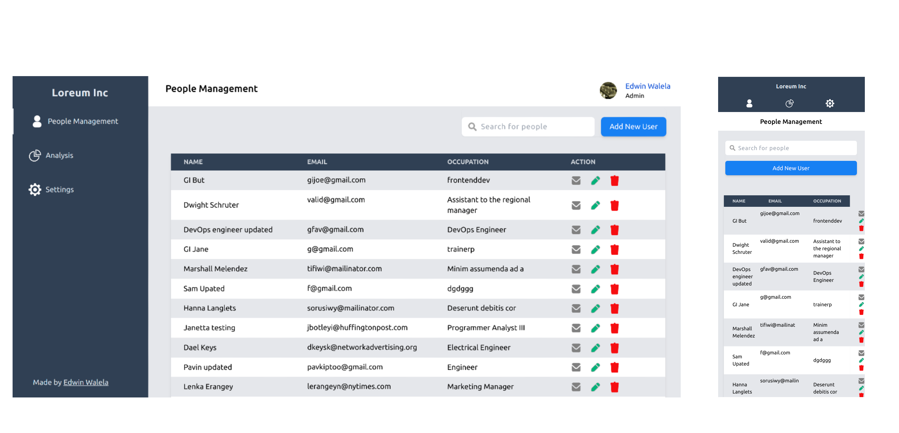

# Loreum Inc

[](https://app.netlify.com/sites/loquacious-druid-4b50bd/deploys)

HR management dashboard for a fictional organization.

Design Inspiration - [Dribbble](https://dribbble.com/shots/14135589-User-Management-Table)

## Responsive Design



<br/>

## Tech Stack

- ReactJS (Vite + Typescript)
- Redux (Redux ToolKit)
- TailwindCSS

## Local Development

Clone repository

```bash
https://github.com/EdwinWalela/loreum-inc
```

Install dependancies

```bash
cd loreum-inc && npm i
```

Create `env` file

```bash
cp example.env .env
```

Start development server

```bash
npm run dev
```
